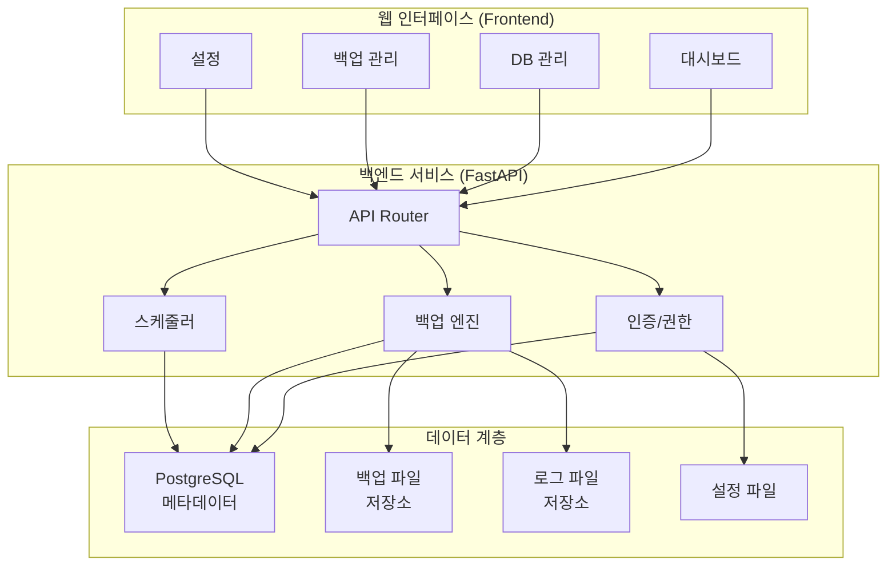
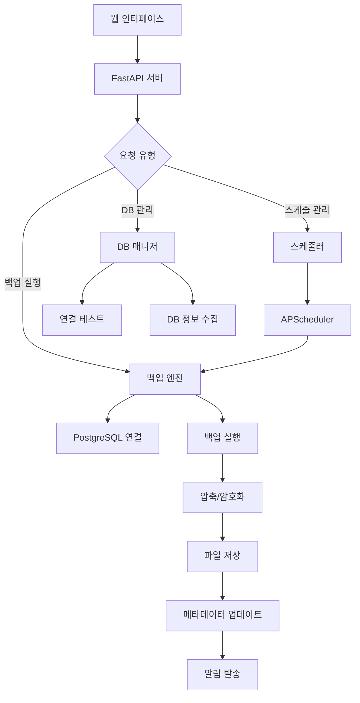

# 클라우드 데이터베이스 자동 백업 시스템 기획서

## 📋 목차

1. [프로젝트 개요](#1-프로젝트-개요)
2. [기술 스택](#2-기술-스택)
3. [시스템 아키텍처](#3-시스템-아키텍처)
4. [핵심 기능 명세](#4-핵심-기능-명세)
5. [다중 데이터베이스 지원](#5-다중-데이터베이스-지원)
6. [백업 전략](#6-백업-전략)
7. [보안](#7-보안)
8. [모니터링 및 알림](#8-모니터링-및-알림)
9. [REST API 명세](#9-rest-api-명세)
10. [개발 단계별 구현 계획](#10-개발-단계별-구현-계획)
11. [운영 가이드](#11-운영-가이드)
12. [확장성 및 고가용성](#12-확장성-및-고가용성)

---

## 1. 프로젝트 개요

### 1.1 목적

- 클라우드 데이터베이스를 로컬 하드디스크에 주기적으로 자동 백업
- 데이터 손실 위험 최소화 및 재해 복구 대비
- 백업 과정의 자동화를 통한 운영 효율성 향상
- 다중 데이터베이스 환경에서의 통합 백업 관리

### 1.2 핵심 기능

- ✅ **다중 데이터베이스 지원**: 여러 PostgreSQL 인스턴스 동시 관리
- ✅ **스케줄링된 자동 백업**: 우선순위 기반 스케줄링
- ✅ **증분 백업 및 전체 백업**: WAL 기반 PITR 지원
- ✅ **백업 파일 압축 및 암호화**: AES-256 암호화
- ✅ **웹 기반 관리 인터페이스**: 직관적인 대시보드
- ✅ **실시간 모니터링 및 알림**: 계층적 알림 시스템
- ✅ **백업 파일 보존 정책**: 환경별 차등 정책
- ✅ **로그 및 에러 추적**: 상세한 감사 로그

## 2. 기술 스택

### 2.1 백엔드 기술

| 구분              | 기술        | 버전   | 용도               |
| ----------------- | ----------- | ------ | ------------------ |
| **언어**          | Python      | 3.8+   | 메인 개발 언어     |
| **웹 프레임워크** | FastAPI     | 0.104+ | REST API 서버      |
| **데이터베이스**  | PostgreSQL  | 13+    | 메타데이터 저장    |
| **스케줄러**      | APScheduler | 3.10+  | 백업 작업 스케줄링 |

### 2.2 핵심 라이브러리

```python
# requirements.txt
fastapi==0.104.1
uvicorn==0.24.0
psycopg2-binary==2.9.7
asyncpg==0.29.0
apscheduler==3.10.4
cryptography==41.0.7
pydantic==2.5.0
sqlalchemy==2.0.23
alembic==1.13.1
aiofiles==23.2.1
python-multipart==0.0.6
jinja2==3.1.2
```

### 2.3 프론트엔드 기술

| 구분                | 기술         | 용도                 |
| ------------------- | ------------ | -------------------- |
| **UI 프레임워크**   | Bootstrap 5  | 반응형 웹 인터페이스 |
| **차트 라이브러리** | Chart.js     | 백업 통계 시각화     |
| **캘린더**          | FullCalendar | 백업 스케줄 관리     |
| **알림**            | SweetAlert2  | 사용자 알림          |

### 2.4 외부 도구 및 서비스

- **PostgreSQL 도구**: `pg_dump`, `pg_restore`, `pg_basebackup`
- **압축**: `gzip`, `lz4`, `zstd`
- **알림 서비스**: SMTP, Slack API, Discord Webhook
- **모니터링**: Prometheus (선택사항)

## 3. 시스템 아키텍처

### 3.1 전체 시스템 구조



### 3.2 디렉토리 구조

```mermaid
graph TD
    A[LocalBackUpManager/] --> B[app/]
    A --> C[web/]
    A --> D[data/]
    A --> E[config/]
    A --> F[tests/]
    A --> G[docs/]
    A --> H[requirements.txt]
    A --> I[docker-compose.yml]
    A --> J[Dockerfile]
    A --> K[README.md]

    B --> B1[main.py]
    B --> B2[config.py]
    B --> B3[database.py]
    B --> B4[api/]
    B --> B5[core/]
    B --> B6[models/]
    B --> B7[schemas/]
    B --> B8[utils/]

    B4 --> B41[databases.py]
    B4 --> B42[backups.py]
    B4 --> B43[schedules.py]
    B4 --> B44[monitoring.py]

    B5 --> B51[backup_engine.py]
    B5 --> B52[database_manager.py]
    B5 --> B53[scheduler.py]
    B5 --> B54[encryption.py]
    B5 --> B55[compression.py]
    B5 --> B56[notification.py]

    C --> C1[static/]
    C --> C2[templates/]
    C1 --> C11[css/]
    C1 --> C12[js/]
    C1 --> C13[images/]

    D --> D1[backups/]
    D --> D2[logs/]
    D --> D3[postgresql_metadata]
    D1 --> D11[full/]
    D1 --> D12[incremental/]
    D1 --> D13[archive/]

    E --> E1[settings.yaml]
    E --> E2[databases.yaml]
```



### 3.3 데이터 플로우



## 4. 핵심 기능 명세

### 4.1 백업 엔진 (BackupEngine)

```python
class BackupEngine:
    """백업 실행의 핵심 엔진"""

    async def execute_full_backup(self, db_id: str) -> BackupResult:
        """전체 백업 실행"""

    async def execute_incremental_backup(self, db_id: str) -> BackupResult:
        """WAL 기반 증분 백업 실행"""

    async def execute_pitr_backup(self, db_id: str) -> BackupResult:
        """Point-in-Time Recovery 백업"""

    def compress_backup(self, file_path: str, algorithm: str) -> str:
        """백업 파일 압축 (gzip, lz4, zstd)"""

    def encrypt_backup(self, file_path: str, key: str) -> str:
        """AES-256 암호화"""

    async def validate_backup(self, backup_id: str) -> ValidationResult:
        """백업 무결성 검증"""

    def cleanup_old_backups(self, retention_policy: dict) -> CleanupResult:
        """보존 정책에 따른 정리"""
```

### 4.2 데이터베이스 매니저 (DatabaseManager)

```python
class DatabaseManager:
    """다중 데이터베이스 연결 및 관리"""

    async def add_database(self, config: DatabaseConfig) -> Database:
        """새 데이터베이스 추가"""

    async def test_connection(self, db_id: str) -> ConnectionResult:
        """연결 상태 테스트"""

    async def get_database_info(self, db_id: str) -> DatabaseInfo:
        """DB 메타데이터 수집"""

    async def execute_pg_dump(self, db_id: str, options: dict) -> str:
        """pg_dump 실행"""

    async def get_table_statistics(self, db_id: str) -> List[TableStat]:
        """테이블별 통계 정보"""

    def get_connection_pool(self, db_id: str) -> asyncpg.Pool:
        """연결 풀 관리"""
```

### 4.3 스케줄 매니저 (ScheduleManager)

```python
class ScheduleManager:
    """APScheduler 기반 스케줄링"""

    def create_schedule(self, schedule_config: ScheduleConfig) -> Schedule:
        """새 스케줄 생성"""

    def update_schedule(self, schedule_id: str, config: ScheduleConfig) -> Schedule:
        """스케줄 수정"""

    def pause_schedule(self, schedule_id: str) -> bool:
        """스케줄 일시 중지"""

    def resume_schedule(self, schedule_id: str) -> bool:
        """스케줄 재개"""

    def check_conflicts(self, new_schedule: ScheduleConfig) -> List[Conflict]:
        """스케줄 충돌 검사"""

    def get_next_run_times(self, db_id: str) -> List[datetime]:
        """다음 실행 시간 조회"""
```

### 4.4 알림 시스템 (NotificationManager)

```python
class NotificationManager:
    """계층적 알림 시스템"""

    async def send_notification(self, event: NotificationEvent) -> bool:
        """이벤트 기반 알림 발송"""

    async def send_email(self, recipients: List[str], content: EmailContent) -> bool:
        """이메일 알림"""

    async def send_slack_message(self, webhook_url: str, message: SlackMessage) -> bool:
        """Slack 알림"""

    async def send_discord_webhook(self, webhook_url: str, embed: DiscordEmbed) -> bool:
        """Discord 알림"""

    def format_backup_report(self, backup_results: List[BackupResult]) -> Report:
        """백업 보고서 생성"""

    def get_notification_history(self, filters: dict) -> List[NotificationLog]:
        """알림 이력 조회"""
```

## 5. 다중 데이터베이스 지원

### 5.1 설정 파일 구조

#### 5.1.1 메인 설정 (config/settings.yaml)

```yaml
# 애플리케이션 기본 설정
app:
  name: "PostgreSQL Backup Manager"
  version: "1.0.0"
  debug: false
  host: "0.0.0.0"
  port: 8000

# 백업 기본 설정
backup:
  base_path: "./data/backups"
  temp_path: "./data/temp"
  max_parallel_jobs: 3
  default_compression: "gzip"
  default_encryption: true

# 보존 정책
retention:
  default_policy:
    daily: 30 # 30일
    weekly: 12 # 12주
    monthly: 12 # 12개월

# 알림 설정
notifications:
  email:
    enabled: true
    smtp_server: "smtp.gmail.com"
    smtp_port: 587
    use_tls: true
  slack:
    enabled: false
    webhook_url: ""
  discord:
    enabled: false
    webhook_url: ""

# 로깅 설정
logging:
  level: "INFO"
  file_path: "./data/logs/app.log"
  max_size: "10MB"
  backup_count: 5
```

#### 5.1.2 데이터베이스 설정 (config/databases.yaml)

```yaml
# 다중 데이터베이스 설정
databases:
  production_db:
    name: "운영 데이터베이스"
    host: "prod-db.company.com"
    port: 5432
    database: "production"
    username: "backup_user"
    password: "${PROD_DB_PASSWORD}" # 환경변수 사용
    ssl_mode: "require"
    priority: "high"
    environment: "production"

    # 백업 설정
    backup_config:
      full_backup_schedule: "0 2 * * 0" # 매주 일요일 2시
      incremental_schedule: "0 */6 * * *" # 6시간마다
      compression: "lz4"
      encryption: true
      retention_policy:
        daily: 7
        weekly: 4
        monthly: 12

    # 알림 설정
    notifications:
      on_success: ["email"]
      on_failure: ["email", "slack"]
      recipients: ["admin@company.com", "dba@company.com"]

  staging_db:
    name: "스테이징 데이터베이스"
    host: "staging-db.company.com"
    port: 5432
    database: "staging"
    username: "backup_user"
    password: "${STAGING_DB_PASSWORD}"
    ssl_mode: "prefer"
    priority: "medium"
    environment: "staging"

    backup_config:
      full_backup_schedule: "0 3 * * 1" # 매주 월요일 3시
      incremental_schedule: "0 */12 * * *" # 12시간마다
      compression: "gzip"
      encryption: false
      retention_policy:
        daily: 14
        weekly: 8
        monthly: 6

  development_db:
    name: "개발 데이터베이스"
    host: "dev-db.company.com"
    port: 5432
    database: "development"
    username: "dev_user"
    password: "${DEV_DB_PASSWORD}"
    ssl_mode: "disable"
    priority: "low"
    environment: "development"

    backup_config:
      full_backup_schedule: "0 4 * * 6" # 매주 토요일 4시
      incremental_schedule: null # 증분 백업 비활성화
      compression: "gzip"
      encryption: false
      retention_policy:
        daily: 7
        weekly: 2
        monthly: 1
```

#### 5.1.3 환경변수 파일 (.env)

```bash
# 데이터베이스 비밀번호
PROD_DB_PASSWORD=your_production_password
STAGING_DB_PASSWORD=your_staging_password
DEV_DB_PASSWORD=your_development_password

# 암호화 키
ENCRYPTION_KEY=your_32_character_encryption_key

# 알림 설정
SMTP_USERNAME=your_email@company.com
SMTP_PASSWORD=your_app_password
SLACK_WEBHOOK_URL=https://hooks.slack.com/services/...
DISCORD_WEBHOOK_URL=https://discord.com/api/webhooks/...

# 애플리케이션 설정
SECRET_KEY=your_secret_key_for_sessions
DEBUG=false
```

## 6. 백업 전략

### 6.1 백업 유형 및 방법

| 백업 유형       | 방법                    | 용도                       | 복구 시간 | 저장 공간 |
| --------------- | ----------------------- | -------------------------- | --------- | --------- |
| **전체 백업**   | `pg_dump`               | 완전한 데이터베이스 복사본 | 빠름      | 큼        |
| **증분 백업**   | WAL 아카이빙            | 변경된 데이터만 백업       | 중간      | 작음      |
| **PITR 백업**   | `pg_basebackup` + WAL   | 특정 시점 복구             | 느림      | 중간      |
| **스키마 백업** | `pg_dump --schema-only` | 구조만 백업                | 매우 빠름 | 매우 작음 |
| **데이터 백업** | `pg_dump --data-only`   | 데이터만 백업              | 빠름      | 큼        |

### 6.2 환경별 백업 전략

#### 6.2.1 운영 환경 (Production)

```yaml
전략: 고가용성 + 빠른 복구
- 전체 백업: 매주 일요일 02:00
- 증분 백업: 6시간마다
- PITR 백업: 연속 WAL 아카이빙
- 보존 기간: 일간 7일, 주간 4주, 월간 12개월
- 압축: LZ4 (속도 우선)
- 암호화: AES-256 (필수)
```

#### 6.2.2 스테이징 환경 (Staging)

```yaml
전략: 균형잡힌 백업
- 전체 백업: 매주 월요일 03:00
- 증분 백업: 12시간마다
- 보존 기간: 일간 14일, 주간 8주, 월간 6개월
- 압축: GZIP (표준)
- 암호화: 선택사항
```

#### 6.2.3 개발 환경 (Development)

```yaml
전략: 최소한의 백업
- 전체 백업: 매주 토요일 04:00
- 증분 백업: 비활성화
- 보존 기간: 일간 7일, 주간 2주, 월간 1개월
- 압축: GZIP
- 암호화: 비활성화
```

### 6.3 백업 우선순위 및 리소스 관리

#### 6.3.1 우선순위 매트릭스

```python
PRIORITY_MATRIX = {
    'high': {
        'max_parallel_jobs': 1,
        'cpu_limit': '80%',
        'memory_limit': '4GB',
        'io_priority': 'high',
        'retry_count': 5
    },
    'medium': {
        'max_parallel_jobs': 2,
        'cpu_limit': '60%',
        'memory_limit': '2GB',
        'io_priority': 'normal',
        'retry_count': 3
    },
    'low': {
        'max_parallel_jobs': 3,
        'cpu_limit': '40%',
        'memory_limit': '1GB',
        'io_priority': 'low',
        'retry_count': 1
    }
}
```

#### 6.3.2 동적 스케줄링

- **시간 분산**: 동일 시간대 백업 방지
- **리소스 모니터링**: CPU/메모리 사용량 기반 지연
- **네트워크 최적화**: 대역폭 사용량 제한

## 7. 보안

### 7.1 데이터 보안

- 백업 파일 AES-256 암호화
- 데이터베이스 연결 정보 암호화 저장
- sSL/TLS 연결 사용

### 7.2 접근 제어

- 백업 디렉토리 권한 제한 (700)
- 설정 파일 권한 제한 (600)
- 로그 파일 보안 설정

### 7.3 네트워크 보안

- VPN 연결을 통한 데이터베이스 접근
- 방화벽 규칙 설정
- IP 화이트리스트 사용

## 8. 모니터링 및 알림

### 8.1 모니터링 항목

- 백업 성공/실패 상태
- 백업 파일 크기 및 소요 시간
- 디스크 사용량
- 데이터베이스 연결 상태

### 8.2 알림 조건

- 백업 실패 시 즉시 알림
- 디스크 사용량 80% 초과 시 경고
- 백업 파일 크기 급격한 변화 시 알림
- 연속 백업 실패 시 긴급 알림

## 9. REST API 다중 데이터베이스 지원

### 9.1 데이터베이스 관리 API

```plaintext
GET    /api/databases              # 모든 데이터베이스 목록 조회
POST   /api/databases              # 새 데이터베이스 추가
GET    /api/databases/{db_id}      # 특정 데이터베이스 정보 조회
PUT    /api/databases/{db_id}      # 데이터베이스 설정 수정
DELETE /api/databases/{db_id}      # 데이터베이스 제거
POST   /api/databases/{db_id}/test # 데이터베이스 연결 테스트
GET    /api/databases/{db_id}/status # 데이터베이스 상태 조회
POST   /api/databases/{db_id}/pause  # 데이터베이스 백업 일시 중지
POST   /api/databases/{db_id}/resume # 데이터베이스 백업 재개
```

### 9.2 백업 관리 API (다중 DB 대응)

```plaintext
GET    /api/backups                    # 모든 DB 백업 목록 조회
GET    /api/backups/database/{db_id}   # 특정 DB 백업 목록 조회
POST   /api/backups/database/{db_id}   # 특정 DB 수동 백업 실행
POST   /api/backups/multi              # 다중 DB 백업 실행
GET    /api/backups/{backup_id}        # 백업 상세 정보 조회
DELETE /api/backups/{backup_id}        # 백업 파일 삭제
GET    /api/backups/{backup_id}/download # 백업 파일 다운로드
POST   /api/backups/{backup_id}/restore  # 백업 복원
GET    /api/backups/statistics          # 전체 백업 통계
GET    /api/backups/statistics/{db_id}  # 특정 DB 백업 통계
```

### 9.3 스케줄 관리 API (다중 DB 대응)

```plaintext
GET    /api/schedules                  # 모든 스케줄 조회
GET    /api/schedules/database/{db_id} # 특정 DB 스케줄 조회
POST   /api/schedules/database/{db_id} # 특정 DB 스케줄 생성
PUT    /api/schedules/{schedule_id}    # 스케줄 수정
DELETE /api/schedules/{schedule_id}    # 스케줄 삭제
POST   /api/schedules/{schedule_id}/toggle # 스케줄 활성화/비활성화
GET    /api/schedules/conflicts        # 스케줄 충돌 검사
```

### 9.4 캘린더 API (다중 DB 대응)

```
GET    /api/calendar/events                    # 모든 DB 캘린더 이벤트
GET    /api/calendar/events/database/{db_id}   # 특정 DB 캘린더 이벤트
POST   /api/calendar/events/database/{db_id}   # 특정 DB 이벤트 생성
GET    /api/calendar/events/range              # 날짜 범위별 이벤트
POST   /api/calendar/events/{id}/reschedule    # 스케줄 변경
GET    /api/calendar/statistics                # 전체 캘린더 통계
GET    /api/calendar/statistics/{db_id}        # 특정 DB 캘린더 통계
```

## 10. 다중 데이터베이스 모니터링 및 알림

### 10.1 통합 모니터링 대시보드

#### 10.1.1 전체 시스템 상태

- 활성 데이터베이스 수: 연결된 DB / 전체 등록된 DB
- 진행중인 백업: 현재 실행중인 백업 작업 목록
- 시스템 리소스: CPU, 메모리, 디스크, 네트워크 사용량
- 경고 및 알림: 우선순위별 경고 메시지

#### 10.1.2 데이터베이스별 상태 매트릭스

```plaintext
+-----------------+--------+------------+----------+-----------+
| Database        | Status | Last Backup| Next     | Success % |
+-----------------+--------+------------+----------+-----------+
| Production DB   | 🟢 ON  | 2시간 전    | 22시간 후 | 98.5%     |
| Staging DB      | 🟢 ON  | 4시간 전    | 20시간 후 | 95.2%     |
| Development DB  | 🔴 OFF | 2일 전      | 중지됨    | 87.3%     |
+-----------------+--------+------------+----------+-----------+
```

### 10.2 계층적 알림 시스템

#### 10.2.1 알림 우선순위

- CRITICAL: 운영 DB 백업 실패, 연결 끊김
- WARNING: 스테이징 DB 문제, 디스크 공간 부족
- INFO: 개발 DB 이슈, 백업 완료 알림

#### 10.2.2 알림 채널별 분배

```python
NOTIFICATION_MATRIX = {
    'production': {
        'critical': ['email', 'slack', 'sms'],
        'warning': ['email', 'slack'],
        'info': ['slack']
    },
    'staging': {
        'critical': ['email', 'slack'],
        'warning': ['email'],
        'info': ['slack']
    },
    'development': {
        'critical': ['email'],
        'warning': ['slack'],
        'info': ['log_only']
    }
}
```

### 10.3 성능 모니터링 및 최적화

#### 10.3.1 백업 성능 메트릭

- `처리량`: DB별 백업 속도 (MB/s)
- `동시 작업`: 병렬 백업 작업 수 모니터링
- `리소스 경합`: DB 서버별 리소스 사용량
- `네트워크 대역폭`: 전체 대역폭 사용량 추적

#### 10.3.2 자동 최적화

- `동적 스케줄링`: 시스템 부하에 따른 백업 시간 자동 조정
- `리소스 기반 우선순위`: CPU/메모리 상황에 따른 우선순위 동적 변경
- `대역폭 조절`: 네트워크 상태에 따른 백업 속도 자동 조절

## 11. 보안 강화 (다중 DB 환경)

### 11.1 데이터베이스별 보안 정책

#### 11.1.1 접근 권한 관리

- `환경별 접근 제어`: 운영 DB는 특별 권한 필요
- `역할 기반 접근`: DBA, 개발자, 모니터링 사용자별 권한 분리
- `IP 화이트리스트`: DB별 허용 IP 주소 관리

#### 11.1.2 암호화 정책

- `환경별 암호화`: 운영 DB는 강제 암호화, 개발 DB는 선택적
- `키 관리`: DB별 독립적인 암호화 키 사용
- `키 순환`: 정기적인 암호화 키 갱신

### 11.2 감사 및 규정 준수

#### 11.2.1 감사 로그

- `접근 기록`: DB별 접근 및 백업 실행 로그
- `변경 추적`: 설정 변경, 스케줄 수정 등 모든 변경 사항 기록
- `권한 변경`: 사용자 권한 변경 이력 추적

#### 11.2.2 규정 준수 리포트

- `자동 리포트`: 월간/분기별 백업 현황 리포트
- `SLA 모니터링`: DB별 백업 SLA 준수 현황
- `규정 확인`: GDPR, HIPAA 등 규정 준수 체크리스트

## 12. 확장성 및 성능 최적화

### 12.1 수평 확장 지원

### 12.1.1 마스터-워커 아키텍처

```text
[웹 인터페이스] → [마스터 노드] → [워커 노드 1] → DB Group A
                              → [워커 노드 2] → DB Group B
                              → [워커 노드 3] → DB Group C
```

#### 12.1.2 로드 밸런싱

- `DB 그룹화`: 지리적/논리적 위치별 DB 그룹핑
- `워커 할당`: 각 워커 노드에 DB 그룹 할당
- `장애 복구`: 워커 노드 장애 시 다른 노드로 자동 이전

### 12.2 캐싱 및 최적화

#### 12.2.1 메타데이터 캐싱

- `DB 상태`: 연결 상태, 크기 정보 캐싱
- `스케줄 정보`: 다음 실행 시간, 마지막 백업 정보 캐싱
- `통계 데이터`: 성공률, 평균 소요 시간 등 캐싱

#### 12.2.2 백업 최적화

중복 제거: 동일 서버의 여러 DB에서 공통 데이터 식별
압축 최적화: DB 특성에 따른 최적 압축 알고리즘 선택
병렬 처리: 테이블별 병렬 덤프 지원

## 10. 개발 단계별 구현 계획

### 10.1 Phase 1: 핵심 인프라 구축 (3-4주)

#### 🎯 목표: 기본 시스템 아키텍처 및 단일 DB 백업 기능

**주요 작업:**

- [ ] 프로젝트 구조 설정 및 개발 환경 구축
- [ ] FastAPI 기반 REST API 서버 구현
- [ ] PostgreSQL 메타데이터 데이터베이스 설계
- [ ] 기본 백업 엔진 구현 (pg_dump 기반)
- [ ] 설정 파일 관리 시스템
- [ ] 기본 로깅 및 에러 처리

**완료 기준:**

- 단일 PostgreSQL DB 연결 및 백업 실행
- 백업 파일 압축 및 기본 암호화
- REST API 기본 엔드포인트 동작
- 설정 파일 기반 DB 연결 관리

### 10.2 Phase 2: 다중 데이터베이스 지원 (2-3주)

#### 🎯 목표: 여러 데이터베이스 동시 관리 및 백업

**주요 작업:**

- [ ] DatabaseManager 클래스 구현
- [ ] 다중 DB 설정 파일 구조 (YAML)
- [ ] 환경변수 기반 보안 설정
- [ ] 우선순위 기반 백업 스케줄링
- [ ] 병렬 백업 처리 시스템
- [ ] DB별 개별 설정 지원

**완료 기준:**

- 3개 이상의 DB 동시 관리
- 환경별 차등 백업 정책 적용
- 백업 충돌 방지 및 리소스 관리
- DB별 독립적인 스케줄 설정

### 10.3 Phase 3: 웹 인터페이스 개발 (3-4주)

#### 🎯 목표: 사용자 친화적인 웹 관리 인터페이스

**주요 작업:**

- [ ] Bootstrap 5 기반 반응형 UI
- [ ] 대시보드 페이지 (실시간 상태 모니터링)
- [ ] 데이터베이스 관리 페이지
- [ ] 백업 관리 및 이력 페이지
- [ ] 스케줄 관리 페이지 (FullCalendar 연동)
- [ ] 설정 페이지
- [ ] Chart.js 기반 통계 시각화

**완료 기준:**

- 모든 기능의 웹 UI 제공
- 실시간 백업 진행 상황 표시
- 직관적인 스케줄 관리 인터페이스
- 백업 통계 및 트렌드 시각화

### 10.4 Phase 4: 고급 기능 및 최적화 (2-3주)

#### 🎯 목표: 성능 최적화 및 고급 백업 기능

**주요 작업:**

- [ ] WAL 기반 증분 백업 구현
- [ ] PITR (Point-in-Time Recovery) 지원
- [ ] 백업 검증 및 복원 테스트 자동화
- [ ] 압축 알고리즘 최적화 (LZ4, ZSTD)
- [ ] 백업 메타데이터 관리 강화
- [ ] 성능 모니터링 및 메트릭 수집

**완료 기준:**

- 증분 백업 정상 동작
- 백업 파일 자동 검증
- 성능 최적화된 압축/암호화
- 상세한 백업 메타데이터 관리

### 10.5 Phase 5: 알림 및 모니터링 시스템 (2주)

#### 🎯 목표: 포괄적인 알림 및 모니터링 시스템

**주요 작업:**

- [ ] 다채널 알림 시스템 (Email, Slack, Discord)
- [ ] 계층적 알림 정책 구현
- [ ] 실시간 모니터링 대시보드
- [ ] 백업 성공률 및 성능 메트릭
- [ ] 자동 리포트 생성
- [ ] 알림 이력 및 통계

**완료 기준:**

- 환경별 차등 알림 정책 적용
- 실시간 시스템 상태 모니터링
- 자동화된 주간/월간 리포트
- 알림 채널별 메시지 포맷 최적화

### 10.6 Phase 6: 보안 및 컴플라이언스 (2주)

#### 🎯 목표: 엔터프라이즈급 보안 및 규정 준수

**주요 작업:**

- [ ] 환경별 보안 정책 구현
- [ ] 감사 로그 시스템
- [ ] 접근 권한 관리
- [ ] 암호화 키 관리 시스템
- [ ] 규정 준수 리포트 (GDPR, HIPAA)
- [ ] 보안 취약점 검사

**완료 기준:**

- 모든 민감 정보 암호화
- 상세한 감사 로그 기록
- 규정 준수 자동 체크
- 보안 정책 자동 적용

### 10.7 Phase 7: 테스트 및 배포 준비 (2주)

#### 🎯 목표: 프로덕션 배포 준비 및 품질 보증

**주요 작업:**

- [ ] 단위 테스트 및 통합 테스트
- [ ] 성능 및 부하 테스트
- [ ] 장애 복구 시나리오 테스트
- [ ] Docker 컨테이너화
- [ ] 배포 자동화 (CI/CD)
- [ ] 운영 문서 작성

**완료 기준:**

- 90% 이상 테스트 커버리지
- 성능 벤치마크 통과
- Docker 기반 배포 가능
- 완전한 운영 문서 제공

### 10.8 전체 일정 요약

| Phase       | 기간        | 핵심 목표         | 주요 결과물                    |
| ----------- | ----------- | ----------------- | ------------------------------ |
| **Phase 1** | 3-4주       | 기본 인프라       | 단일 DB 백업 시스템            |
| **Phase 2** | 2-3주       | 다중 DB 지원      | 다중 DB 관리 시스템            |
| **Phase 3** | 3-4주       | 웹 인터페이스     | 완전한 웹 UI                   |
| **Phase 4** | 2-3주       | 고급 기능         | 증분 백업, 성능 최적화         |
| **Phase 5** | 2주         | 알림/모니터링     | 통합 모니터링 시스템           |
| **Phase 6** | 2주         | 보안/컴플라이언스 | 엔터프라이즈 보안              |
| **Phase 7** | 2주         | 테스트/배포       | 프로덕션 준비 완료             |
| **총 기간** | **16-21주** | **완전한 시스템** | **엔터프라이즈급 백업 솔루션** |

## 11. 운영 가이드

### 11.1 설치 및 배포

#### 11.1.1 시스템 요구사항

```yaml
최소 요구사항:
  OS: Linux/Windows/macOS
  Python: 3.8+
  RAM: 2GB
  Storage: 10GB (시스템) + 백업 용량
  Network: 안정적인 인터넷 연결

권장 요구사항:
  OS: Ubuntu 20.04 LTS / CentOS 8
  Python: 3.11+
  RAM: 8GB
  Storage: SSD 50GB + 백업 전용 스토리지
  Network: 1Gbps 이상
```

#### 11.1.2 설치 과정

```bash
# 1. 저장소 클론
git clone https://github.com/your-org/LocalBackUpManager.git
cd LocalBackUpManager

# 2. 가상환경 생성 및 활성화
python -m venv venv
source venv/bin/activate  # Linux/Mac
# venv\Scripts\activate   # Windows

# 3. 의존성 설치
pip install -r requirements.txt

# 4. 환경 설정
cp config/settings.yaml.example config/settings.yaml
cp config/databases.yaml.example config/databases.yaml
cp .env.example .env

# 5. 데이터베이스 초기화
python -m app.database init

# 6. 설정 검증
python -m app.main validate-config

# 7. 서비스 시작
python -m app.main
```

#### 11.1.3 Docker 배포

```yaml
# docker-compose.yml
version: "3.8"
services:
  backup-manager:
    build: .
    ports:
      - "8000:8000"
    volumes:
      - ./data:/app/data
      - ./config:/app/config
      - ./logs:/app/logs
    environment:
      - ENVIRONMENT=production
    restart: unless-stopped

  nginx:
    image: nginx:alpine
    ports:
      - "80:80"
      - "443:443"
    volumes:
      - ./nginx.conf:/etc/nginx/nginx.conf
      - ./ssl:/etc/ssl
    depends_on:
      - backup-manager
    restart: unless-stopped
```

### 11.2 운영 모니터링

#### 11.2.1 핵심 메트릭

| 메트릭         | 임계값        | 알림 레벨 |
| -------------- | ------------- | --------- |
| 백업 성공률    | < 95%         | WARNING   |
| 백업 성공률    | < 90%         | CRITICAL  |
| 디스크 사용률  | > 80%         | WARNING   |
| 디스크 사용률  | > 90%         | CRITICAL  |
| 백업 소요 시간 | > 평균의 150% | WARNING   |
| 연속 실패 횟수 | >= 3          | CRITICAL  |

#### 11.2.2 로그 관리

```bash
# 로그 레벨별 파일 분리
logs/
├── app.log          # 일반 애플리케이션 로그
├── backup.log       # 백업 관련 로그
├── error.log        # 에러 로그
├── audit.log        # 감사 로그
└── performance.log  # 성능 메트릭 로그

# 로그 로테이션 설정 (logrotate)
/etc/logrotate.d/backup-manager:
/app/logs/*.log {
    daily
    rotate 30
    compress
    delaycompress
    missingok
    notifempty
    create 644 app app
}
```

### 11.3 백업 및 복구 절차

#### 11.3.1 수동 백업 실행

```bash
# 특정 데이터베이스 백업
curl -X POST "http://localhost:8000/api/backups/database/production_db" \
  -H "Content-Type: application/json" \
  -d '{"backup_type": "full", "compression": "lz4"}'

# 모든 데이터베이스 백업
curl -X POST "http://localhost:8000/api/backups/multi" \
  -H "Content-Type: application/json" \
  -d '{"backup_type": "incremental"}'
```

#### 11.3.2 복구 절차

```bash
# 1. 백업 파일 확인
curl "http://localhost:8000/api/backups/database/production_db"

# 2. 복구 실행
curl -X POST "http://localhost:8000/api/backups/{backup_id}/restore" \
  -H "Content-Type: application/json" \
  -d '{
    "target_database": "production_restored",
    "restore_options": {
      "drop_existing": false,
      "restore_data": true,
      "restore_schema": true
    }
  }'
```

### 11.4 트러블슈팅

#### 11.4.1 일반적인 문제 해결

```bash
# 연결 테스트
python -m app.utils.diagnostic test-connections

# 시스템 상태 확인
python -m app.utils.diagnostic system-health

# 설정 검증
python -m app.utils.diagnostic validate-config

# 백업 파일 무결성 검사
python -m app.utils.diagnostic verify-backups --days 7
```

#### 11.4.2 성능 최적화

```python
# 백업 성능 튜닝 가이드
PERFORMANCE_TUNING = {
    'small_db': {  # < 1GB
        'parallel_jobs': 1,
        'compression': 'gzip',
        'chunk_size': '64MB'
    },
    'medium_db': {  # 1GB - 100GB
        'parallel_jobs': 2,
        'compression': 'lz4',
        'chunk_size': '256MB'
    },
    'large_db': {  # > 100GB
        'parallel_jobs': 4,
        'compression': 'zstd',
        'chunk_size': '1GB'
    }
}
```

## 12. 확장성 및 고가용성

### 12.1 수평 확장 아키텍처

#### 12.1.1 마스터-워커 모델

```plaintext
┌─────────────────┐    ┌─────────────────┐    ┌─────────────────┐
│   Load Balancer │    │   Master Node   │    │  Worker Node 1  │
│    (Nginx)      │───▶│   (Scheduler)   │───▶│   (Executor)    │
└─────────────────┘    └─────────────────┘    └─────────────────┘
                                │                        │
                                │               ┌─────────────────┐
                                └──────────────▶│  Worker Node 2  │
                                                │   (Executor)    │
                                                └─────────────────┘
```

#### 12.1.2 고가용성 구성

```yaml
# Kubernetes 배포 예시
apiVersion: apps/v1
kind: Deployment
metadata:
  name: backup-manager
spec:
  replicas: 3
  selector:
    matchLabels:
      app: backup-manager
  template:
    metadata:
      labels:
        app: backup-manager
    spec:
      containers:
        - name: backup-manager
          image: backup-manager:latest
          ports:
            - containerPort: 8000
          env:
            - name: REDIS_URL
              value: "redis://redis-service:6379"
            - name: DATABASE_URL
              value: "postgresql://postgres:5432/backup_metadata"
          resources:
            requests:
              memory: "512Mi"
              cpu: "250m"
            limits:
              memory: "2Gi"
              cpu: "1000m"
```

### 12.2 재해 복구 계획

#### 12.2.1 RTO/RPO 목표

| 환경        | RTO   | RPO   | 백업 빈도 | 복구 우선순위 |
| ----------- | ----- | ----- | --------- | ------------- |
| Production  | 15분  | 1시간 | 매시간    | 1             |
| Staging     | 2시간 | 4시간 | 4시간마다 | 2             |
| Development | 1일   | 1일   | 일간      | 3             |

#### 12.2.2 재해 복구 절차

```bash
# 1. 시스템 상태 평가
./scripts/disaster-assessment.sh

# 2. 우선순위 기반 복구 시작
./scripts/recovery-production.sh
./scripts/recovery-staging.sh
./scripts/recovery-development.sh

# 3. 복구 검증
./scripts/verify-recovery.sh
```

---

## 🎯 결론

이 기획서는 **엔터프라이즈급 클라우드 데이터베이스 백업 관리 시스템**을 구축하기 위한 포괄적인 가이드를 제공합니다.

### 핵심 특징

- ✅ **다중 데이터베이스 지원**: 환경별 차등 관리
- ✅ **웹 기반 인터페이스**: 직관적인 관리 도구
- ✅ **자동화된 백업**: 스케줄링 및 모니터링
- ✅ **엔터프라이즈 보안**: 암호화 및 감사 로그
- ✅ **확장 가능한 아키텍처**: 마이크로서비스 기반

### 개발 로드맵

총 **16-21주**에 걸쳐 7개 Phase로 구성된 체계적인 개발 계획을 통해 안정적이고 확장 가능한 백업 솔루션을 구축할 수 있습니다.

이 기획서를 바탕으로 단계별 개발을 진행하시면 안정적이고 확장 가능한 백업 시스템을 구축하실 수 있습니다.
